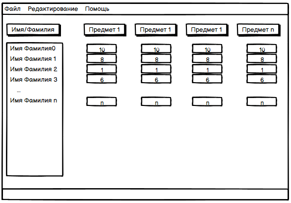
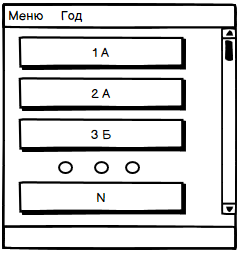

# Требования к проекту
---

# Содержание
1. [Введение](#intro)  
1.1 [Назначение](#appointment)  
1.2 [Бизнес-требования](#business_requirements)  
1.2.1 [Исходные данные](#initial_data)  
1.2.2 [Возможности бизнеса](#business_opportunities)  
1.3 [Аналоги](#analogues)  
1.3.1 [1С:Образование 5. Школа](#1c)  
1.3.2 [Дневник](#dnevnik)  
2. [Требования пользователя](#user_requirements)  
2.1 [Программные интерфейсы](#software_interfaces)  
2.2 [Интерфейс пользователя](#user_interface)  
2.2.1 [Интерфейс меню](#user_interface_menu)  
2.2.2 [Интерфейс класса](#user_interface_class)  
2.3 [Характеристики пользователей](#user_specifications)  
2.3.1 [Аудитория приложения](#application_audience)  
2.3.1.1 [Целевая аудитория](#target_audience)  
2.3.1.1 [Побочная аудитория](#collateral_audience)  
2.4 [Предположения и зависимости](#assumptions_and_dependencies)  
3. [Системные требования](#system_requirements)  
3.1 [Функциональные требования](#functional_requirements)  
3.2 [Нефункциональные требования](#non-functional_requirements)  

<a name="intro"/>

# 1 Введение

<a name="appointment"/>

## 1.1 Назначение
Десктопное приложение "Кактус" преднозначеное для простого регулирования учеников в школе.
Приложение создано для пользователей ОС Windows 10.

<a name="business_requirements"/>

## 1.2 Бизнес-требования

<a name="initial_data"/>

### 1.2.1 Исходные данные
Школа является одним из важнейших периодов в жизни каждого человека. В наше время в школах появляется все больше и больше классов. В связи с этим становится достаточно сложно регулировать огромное количество письменных журналов.  Из-за этого становится популярным ресурсы которые позволяют регулировать все используя только один компьютер.

<a name="business_opportunities"/>

### 1.2.2 Возможности бизнеса
Данное приложение будет пользоваться популярностью не только у школ, а и у университетов, а также детских садов.

<a name = "analogues"/>

## 1.3 Аналоги

<a name = "1c"/>

### 1.3.1 1С:Образование 5. Школа

**Цена:** ~187-190$  
**Ссылка на сайт:** https://obr.1c.ru/educational/prepodavatelyam/1s-obrazovanie-5-shkola/

1С:Образование 5. Школа - усложненный представитель регулирования классов с большим количеством ответвлений от изначальной цели.

<a name = "dnevnik"/>

### 1.3.2 Дневник

**Цена:** бесплатно  
**Ссылка на сайт:** https://dnevnik.ru

Дневник - еще один представитель регулирования классов. Является усложненной версией учета учеников с возможностью пользоваться только имея доступ к интернету.

# 2 Требования пользователя

<a name="software_interfaces"/>

## 2.1 Программные интерфейсы
Разработка будет вестись с использованием языка программировани Python и библиотеки tkinter.

<a name="user_interface"/>

## 2.2 Интерфейс пользователя
Создаваемый программный продукт будет иметь классический графический пользовательский интерфейс.

<a name="user_interface_menu"/>

### 2.2.1 Интерфейс главного меню
Интерфейс пользователя будет содержать главное меню, из которого пользователь сможет выбрать необходимый ему класс, либо удалить старый.

<a name="user_interface_class"/>

### 2.2.2 Интерфейс класса
Когда пользователь выберет нужный ему класс, ему будет доступно изменение оценок, добавление новых учеников, сортировка и т.д

<a name="user_specifications"/>

## 2.3 Характеристики пользователей
Программный продукт нацелен на рядового пользователя, обладающего компьютерными навыками и имеющим/не имеющим опыт с электронными журналами.

<a name="user_classes"/>

### 2.3.1 Аудитория приложения

<a name="target_audience"/>

#### 2.3.1.1 Целевая аудитория
Преподаватели/администрация школы, желающие значительно упростить работу с учениками.

<a name="collateral_audience"/>

#### 2.3.1.2 Побочная аудитория
Преподаватели в дедских садах, не имеющих большое количество классов, но желающих иметь удобный интерфейс учета учеников.

<a name="assumptions_and_dependencies"/>

## 2.4 Предположения и зависимости
1. Программный продукт предпологает наличие клавиатуры, мышки и динамика.

<a name="system_requirements"/>

# 3 Системные требования
Создаваемый программный продукт создается для работы в операционной системе Windows.

<a name="functional_requirements"/>

## 3.1 Функциональные требования
1. Понятный пользовательский интерфейс
2. Наличие удобных графиков
3. Дополнительные возможности в виде факультативов

<a name="non-functional_requirements"/>

## 3.2 Нефункциональные требования
Для создаваемого продукта необходима невысокая требовательность к ресурсам компьютера.
